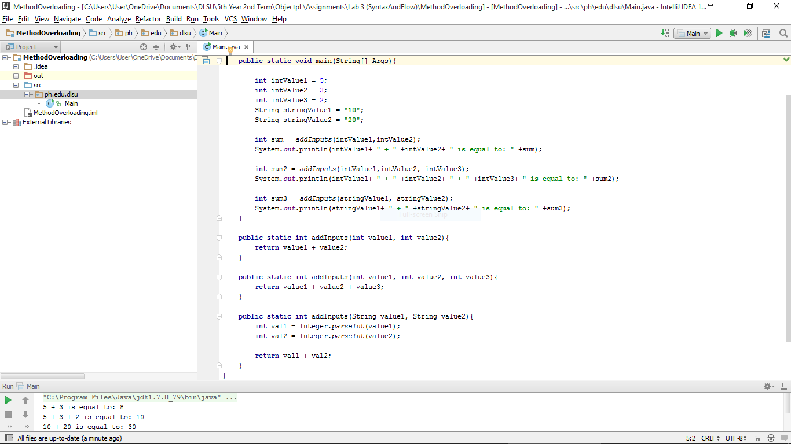

#MethodOverloading

Using of Methods with the same name but with different signatures.

#ScreenShot

#Code

~~~
package ph.edu.dlsu;

public class Main{

    public static void main(String[] Args){

        int intValue1 = 5;
        int intValue2 = 3;
        int intValue3 = 2;
        String stringValue1 = "10";
        String stringValue2 = "20";

        int sum = addInputs(intValue1,intValue2);
        System.out.println(intValue1+ " + " +intValue2+ " is equal to: " +sum);

        int sum2 = addInputs(intValue1,intValue2, intValue3);
        System.out.println(intValue1+ " + " +intValue2+ " + " +intValue3+ " is equal to: " +sum2);

        int sum3 = addInputs(stringValue1, stringValue2);
        System.out.println(stringValue1+ " + " +stringValue2+ " is equal to: " +sum3);
    }

    public static int addInputs(int value1, int value2){
        return value1 + value2;
    }

    public static int addInputs(int value1, int value2, int value3){
        return value1 + value2 + value3;
    }

    public static int addInputs(String value1, String value2){
        int val1 = Integer.parseInt(value1);
        int val2 = Integer.parseInt(value2);

        return val1 + val2;
    }
}
~~~
